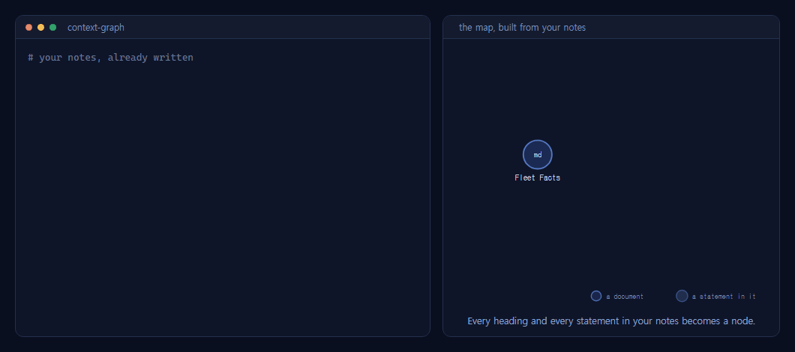
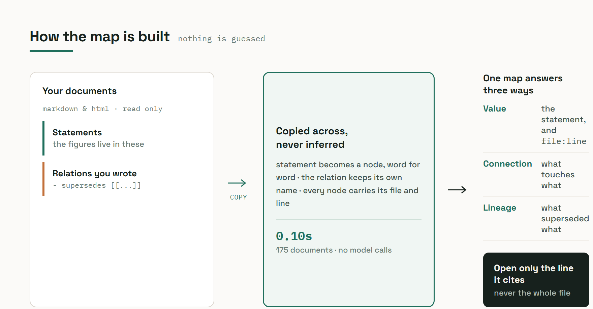
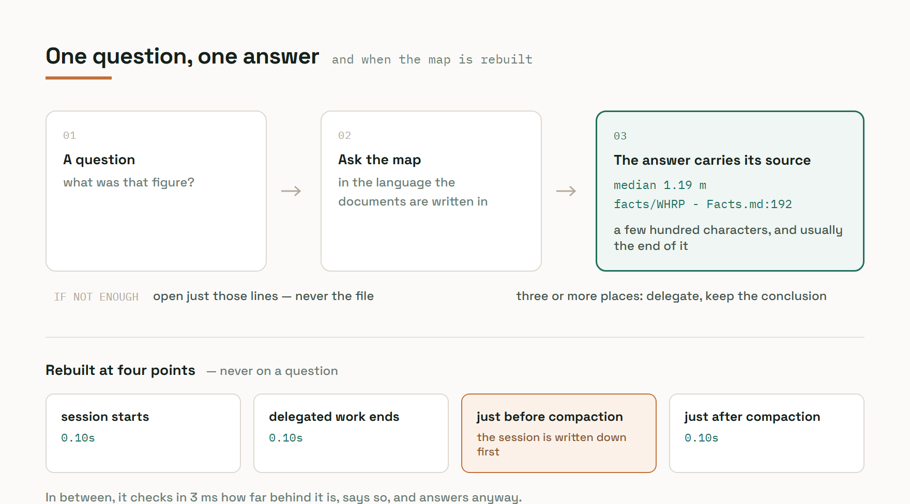

<div align="center">

# Context Graph

### Ask your notes a question. Get the sentence back, with the file and line it sits on.

**A Claude Code plugin · Copies the structure you already wrote · No language model · 100% local**

[](#tests)
[](#why-no-language-model)
[](#same-input-same-output)
[](#requirements)

[](#requirements)
[](#requirements)
[](#requirements)

**175 documents · 8,198 nodes · rebuilt in 0.10 s**

</div>

---

<div align="center">

</div>

**What it is** — your notes already say what links to what. This copies that structure into one
map, then answers a question with **the statement itself, its file and its line number**, instead
of making you open the file. Nothing is guessed: a statement in the map is the statement in the
document, word for word. Building 175 documents takes 0.1 s and calls no model.

| Ask this | Get this |
|---|---|
| `ask.py "<question>"` | the statements that match, each with its file and line |
| `ask.py --path "<a>" "<b>"` | the chain of relations linking two decisions |
| `ask.py --explain "<node>"` | one node and its neighbours |

---

## Contents

- [The problem](#the-problem)
- [Install](#install)
- [First run](#first-run)
- [Why this approach](#why-this-approach)
- [How it works](#how-it-works)
- [Command reference](#command-reference)
- [When it refreshes](#when-it-refreshes)
- [Quality check](#quality-check)
- [Configuration](#configuration)
- [Limits](#limits)
- [Requirements](#requirements)
- [Tests](#tests)
- [Troubleshooting](#troubleshooting)

---

## The problem

Once knowledge documents pile up, **a single check means reading a whole file.**

These are measured numbers. Catching up on one thread of progress means reading **289,000
characters** of two months of notes; finding a document means reading a **49,000 character**
index. There are **1,746 links** already written between documents, and following one of
them still means opening a file.

Context Graph turns that around.

```
$ python ask.py "tray piece length median"

NODE Piece size: longest edge min 0.05 m, **median 1.19 m**, max 99.44 m.
     [src=knowledgeacts\WHRP Plant - Model Contents and Structure Regions - Facts.md loc=192]
NODE Tray pieces attached to no structure rise from 1,033 (18.2%) to 1,141 (25.8%) - the
     structure areas now cover less of the routing.
     [src=knowledge\decisions\ADR 0086 APOC Drops 20 Structure Areas and Their Trays.md loc=33]
...
[also touched: cable_project Handoff, index, WHRP Plant - Model Contents and Structure
 Regions - Facts, Browser 3D Viewers - Facts and 10 more]
```

The statement that matched comes first, the statements around it follow, and the documents they
sit in are named once at the end. Long answers keep going in the same shape; the middle of this
one is cut here to keep the example short.

**You get the statement itself, plus the file and line number it sits on.** That is usually
the end of it; you open the surrounding lines only when you need to confirm. Reading drops
from tens of thousands of characters to a few hundred.

---

## Install

Two commands in Claude Code, then a restart.

### 1. Add the marketplace

```
/plugin marketplace add JadeKim042386/context-graph
```

Nothing to clone — Claude Code fetches it for you.

### 2. Install the plugin

```
/plugin install context-graph
```

This brings the skill, the commands and the refresh hooks with it.

### 3. Restart Claude Code

The hooks and the skill only attach on start.

### 4. Check that it took

```
/plugin
```

Seeing `context-graph` in the list is enough.

### Installing from a local clone instead

Use this when you want to change the code and see it immediately.

```bash
git clone https://github.com/JadeKim042386/context-graph.git
```

```
/plugin marketplace add <clone-path>
/plugin install context-graph
```

A marketplace added from a directory reads the files as they are on disk, so an edit shows up
on the next restart without any publishing step.

### Updating

```
/plugin marketplace update context-graph
```

### Uninstall

```
/plugin uninstall context-graph
/plugin marketplace remove context-graph
```

The map file and the config live **outside** the knowledge documents, so removing the plugin
does not change a single character of them.

---

## First run

The first time you call it after installing, five steps run once.

| | What | Why |
|---|---|---|
| 1 | **Asks where the knowledge documents are** | No path is baked into the code. You can list several places |
| 2 | **Checks whether the tools it uses are present** | If not, it shows what it would install and why, and asks. It never installs silently |
| 3 | **Builds the map for the first time** | Hundreds of documents finish in under a second |
| 4 | **Shows the score** | This is where you find out whether it is any use on your set of documents |
| 5 | **Asks for the compaction threshold** | How full the conversation gets before compaction. Applies from the next session |

**Declining the installs still leaves it working.** Without the query tool, building the map
and scoring work and only asking does not. Without the document tool, only writing the
session into the knowledge documents at compaction is lost.

---

## Why this approach

### Three versions were built and compared

The same 99 decision records were turned into a map three times. The first two handed the
folder to a tool and let **a language model guess the relations**; the third **copied what the
documents already said**.

| | ① delegated · light model | ② delegated · mid model | ③ **copy what is written** |
|---|---|---|---|
| Nodes / links | 149 / 148 | 185 / 446 | **629 / 950** |
| **Nodes carrying a line number** | 6 (4%) | **0** | **626 (99.5%)** |
| Relation kinds | 29 | **4** | **32** |
| Lineage (supersedes, follows) | present | **none at all** | **24, chains intact** |
| Components / isolated nodes | 26 / 18 | 1 / 0 | **1 / 0** |
| Build time | 5 min | 16 min | **0.1 s** |

### The first two produced no values at all

Their nodes had names but **no body and no line number**, so no amount of rephrasing produced
a figure. The maps built cleanly and the cluster names looked plausible, but asking returned
nothing.

**That was a property of the extraction, not of graphs.** Changing what counts as a node
brought the values, the locations and the lineage back at once.

### Why no language model

The structure is **already written** in the knowledge documents.

```markdown
## Decision
- Split the rack along its length by equipment connection density alone: 8 or more endpoints in a 5 m window.

## Relations
- supersedes [[earlier decision]]
- relates_to [[related fact]]
```

A person wrote that by hand. **There is nothing to guess.** It only has to be copied across.
Which is why it is

- **fast** — 0.10 s for 175 documents
- **free** — zero model calls
- **not wrong** — a statement in the map is the statement in the document, verbatim
- **repeatable** — build twice, get byte-identical output

### Same input, same output

Every file walk and every set iteration is sorted and pinned. A test builds the map twice and
compares it byte for byte. That test has to pass before any of the others mean anything —
**if the output changes every run, no fix can be shown to have improved anything.**

---

## How it works



### What becomes a node

| Node | What it is | Location |
|---|---|---|
| Document | one file | file + line 1 |
| Heading | `##`, `###` (`h1`-`h3` in HTML), including the body under it | file + line |
| **Statement** | one paragraph or list item under a heading | file + line |
| Name-only node | a target that is pointed at but exists in no document | none |

**The values live in the statement nodes.** Which is why statement labels are never cut — cut
at 400 characters and the figures at the end disappear from the answers.

### What becomes a link

```
- <word> [[target]]   ->  that word is the relation name (supersedes, follows, corrects ...)
- 대체함 [[target]]     ->  a Korean relation word, stored under its English name (supersedes)
   [[target]]          ->  a mention
```

**A relation word may be written in any script.** Korean notes keep their lineage instead of
losing it to an unnamed mention. The common Korean words are mapped onto the English names the
rest of the map uses — `대체함`/`대체` to `supersedes`, `관련`/`참고` to `relates_to`, `후속` to
`follows`, `정정` to `corrects`, `포함` to `part_of`, and a few more — so a path can run through
documents written in both languages. This is a fixed table in the source, not a translation
service: **no model is called**, and a word outside the table is kept exactly as it was written.
The word still has to be the only thing between the bullet and the link — `- this decision
supersedes [[X]]` is a mention, not a relation.

**It reads the shape of the line, not the name of the section.** So it works on documents with
no `## Relations` section. When a name does not match, it retries with punctuation swapped
(`/`, `:` vs `-`); if there is still no match, it creates a name-only node and links to that.

### HTML follows the same rules

Title becomes the document name, `h1`-`h3` become headings, `p` and `li` become statements,
`a href` becomes a link, tables go one row at a time. **Images, styling and scripts are dropped,
but text inside SVG is kept** — the point a diagram makes usually lives in that text.

### From a question to an answer



---

## Command reference

### `ask.py "<question>"`

Finds the statements that match the question and returns **the statement itself with its file
and line number**.

```bash
python ask.py "chunk boundary equipment endpoint density"
```

### `ask.py --path "<a>" "<b>"`

Shows the shortest chain linking two nodes. Use it to **follow the lineage of a decision**.

```
$ python ask.py --path "ADR 0024 endpoint_dist Global Normalization Replaces Per-Chunk Min-Max"                 "ADR 0023 GNN Coordinates from Excel mm + Per-Chunk MinMax Normalization"

Shortest path (1 hops):
  ADR 0024 endpoint_dist Global Normalization Replaces Per-Chunk Min-Max
  --supersedes_partially--> ADR 0023 GNN Coordinates from Excel mm + Per-Chunk MinMax Normalization
```

Names have to be given in full, and the chain is labelled with the relation words as they were
written. Where a decision both names an earlier one in prose and lists it under `## Relations`,
the named relation is the one that shows — the bare mention is dropped so it cannot hide the
lineage.

### `ask.py --explain "<node>"`

Shows one node and its neighbours. Use it the first time you meet an unfamiliar term.

### `ask.py --rebuild "<question>"`

Rebuilds the map right now, then asks. Not normally needed.

### `build_map.py`

Rebuilds the map. This is what the refresh hooks call.

```bash
python build_map.py                    # scans the folders named in the config
python build_map.py --source <path> --out <map-file>
python build_map.py --quiet            # no score printed
```

---

## When it refreshes

**Asking does not refresh anything.** It runs at four points only.

| When | What |
|---|---|
| A session starts or resumes | rebuild the map |
| **A delegated task (subagent) ends** | rebuild the map |
| Right before the conversation is compacted | write the session into the knowledge documents |
| Right after the conversation is compacted | rebuild the map |

**Why compaction is two points** — writing just before and building just after means **what was
just written makes it into the map** and carries over into the next conversation. At the exact
spot where context is squeezed out, the knowledge moves onto the map.

### It rebuilds everything

It does not pick out only the changed files. **There is nothing left to gain past 0.1 s**, and
a change-picking mechanism has to remember "what changed" — and when that memory drifts,
**stale content survives**.

If a document changes in between, checking costs **2-3 milliseconds** before the question, and
it only **tells you**.

```
[The map is behind 1 document(s) - WHRP Plant... It is refreshed at the next compaction]
```

It never quietly serves a stale answer.

---

## Quality check

**A map can build cleanly and still be half useless.** So every build scores itself on five
things.

| Measured | What a low value means |
|---|---|
| Share of nodes with a location | value lookup does not work |
| Share of nodes that are a whole file | the map is just a list of documents |
| Number of relation kinds | there is no lineage |
| Components and isolated nodes | path finding fails |
| **Sampled value lookup** | the four above can look fine and it still finds nothing |

**The sampled lookup runs automatically.** It picks statements carrying numbers in a fixed way,
actually asks for them, opens the file and line the answer points at, and **checks that the
statement is still there on that line, word for word**.

A low score comes with the cause.

```
located 12% - many documents carry headings only, with no body text under them
few relation kinds - the `- <word> [[target]]` shape is almost absent
```

**A low score does not block anything.** You get to use it knowing what does not work.

### An empty map says why

A map that comes out with nothing in it names the cause, at every refresh point, whether or not
the score is being printed.

```
[the document folder in the config is not there - C:
otesualt]
[no .md, .markdown, .html or .htm documents under C:
otes]
```

**A mistyped path and an empty folder used to look identical** — both ended at `nodes 0`. Now the
first line appears when the folder named in the config is not on disk, and the second when the
folder is there but holds no documents.

---

## Configuration

| Setting | Default | Notes |
|---|---|---|
| Where the knowledge documents are | none | asked on the first run. Several places allowed |
| Where the map goes | outside the knowledge documents | put it inside and the output is picked up as a document |
| Answer budget | `20000` | a measured value. Lower it and statements carrying values get cut |
| Image text extraction | `false` | on, it pulls text out of images |
| Compaction threshold | `auto` | or 100k-1M tokens |

### Image text extraction (optional)

Lets you find tables, error messages and figures inside screenshots. **It is off by default** —
it sends someone else's images outside, so it is never done without asking.

- The key is a **hash of the image contents**, not the file timestamp. Renaming or re-saving does
  not trigger reprocessing
- Building the map **only reads the cache**, so build time is unchanged
- Nodes coming from images are marked **machine-read**, so they never mix with what a person wrote
- No descriptions and no summaries are produced. **Text only**

---

## Limits

Stated plainly. All three are measured.

### 1. Ask in the language the knowledge documents are written in

The map does not recognise the same meaning in different words. Ask in Korean about English
documents and **nothing matches at all.** Whatever language you ask in, match **the documents**.

Relation words are the one exception: `- 대체함 [[X]]` and `- supersedes [[X]]` end up as the
same relation, so lineage still runs across a set of documents written in both languages.

### 2. Ask narrowly

| Question | Answer | Compared to |
|---|---|---|
| `tray piece length median` | statement + line number, a few hundred characters | **far cheaper** than opening the file |
| `correlation clustering local search move objective` | a truncated list filling the budget, 20k tokens | **more expensive** than reading one note |

To sweep a whole topic, hand it to a subagent and take **the conclusion only**. If an answer is
truncated, it says so on the spot.

### 3. Past 800 documents, queries get slow

Measured at 10x the size (2,480 documents).

| | 248 documents | 2,480 documents |
|---|---|---|
| Rebuild | 0.24 s | 2.13 s (tolerable) |
| **Query** | 1.80 s | **15.46 s** |

**What breaks first at scale is the query, not the refresh.** Past that line you need to split
the map into branches and search only the branch that matches the question.

---

## Requirements

| | |
|---|---|
| Python | 3.9 or newer. **Standard library only** |
| OS | Windows · macOS · Linux |
| Query tool | [graphify](https://github.com/safishamsi/graphify) — without it, building and scoring work and asking does not |
| Document tool | [obsidian-second-brain](https://github.com/eugeniughelbur/obsidian-second-brain) — without it, only writing the session at compaction is lost |

Both can be installed **with your approval** during the first run.

---

## Tests

```bash
python -m pytest context-graph/tests -v
```

**All 65 pass.** Three of them matter most.

- **Same input, same output** — build twice, compare byte for byte
- **Sampled value lookup** — compare a statement in the map against that line in the source file
- **Malformed documents** — a case met in real use, kept as test material. Miss it and 41
  value-carrying statements are lost

---

## Troubleshooting

### Text comes out garbled, or `UnicodeEncodeError`

The default console encoding on a Korean Windows box cannot write characters such as an em
dash. The scripts pin their output to UTF-8 at startup, so this usually does not happen. If it
still does:

```bash
PYTHONIOENCODING=utf-8 python ask.py "<question>"
```

### The question returns nothing

Check that you **asked in the language of the documents**. English documents need an English
question.

### The answer comes back truncated

The question was too broad. Narrow the words, or hand the topic to a subagent.

### The map answers with stale content

Refreshes run only at session start, when a delegated task ends, and before and after
compaction. To reflect changes right now:

```bash
python ask.py --rebuild "<question>"
```

### The score comes out low

The map does not fit that set of documents well. Read the hints that come with the score —
usually the body under the headings is empty, or there are no `- <word> [[target]]` relations.

---

## License

MIT
