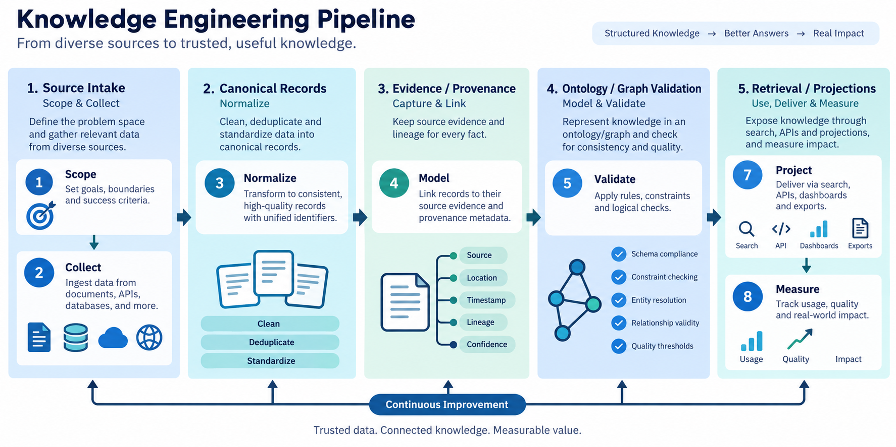
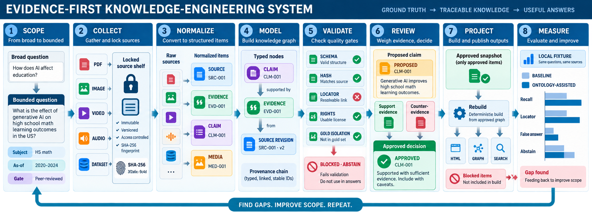
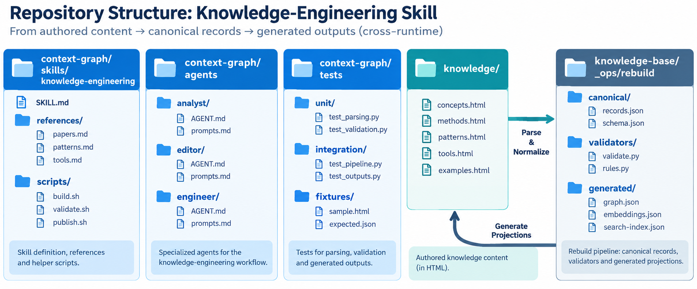
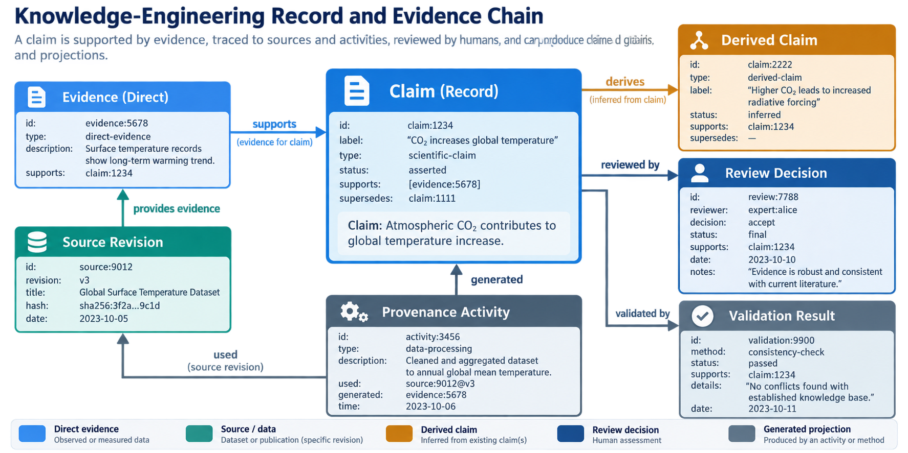

# Context Graph · Knowledge Engineering Skill

This project provides a cross-runtime Knowledge Engineering Skill for Codex and
Claude Code. It turns source material into traceable, reviewable knowledge and
HTML-first projections that answer with evidence or deliberately abstain.

## 1. Overall structure



The system moves from a bounded question and preserved source material to
canonical records, evidence checks, graph validation, projections, and measured
retrieval. The final answer state is `answer`, `conflict`, or `abstain`.

## 2. Operation flow and order



The workflow has eight ordered stages:

1. **Scope** — define the question, domain, date, and acceptance criteria.
2. **Collect** — preserve documents, datasets, images, video, audio, or URLs.
3. **Normalize** — create stable Source, Evidence, Claim, Media, and provenance records.
4. **Model** — represent typed entities, relations, time, and ontology constraints.
5. **Validate** — check schemas, locators, hashes, freshness, reasoning, conflicts, and gold isolation.
6. **Review** — compare supporting and counter-evidence and decide accept, revise, hold, or reject.
7. **Project** — rebuild HTML, graph, search, reports, Context Packs, memory pointers, and optional Archify diagrams.
8. **Measure** — compare strategies on the same snapshot and question order.

The analysis/proposal role is read-only and returns an evidence-backed handoff.
Together, analysis, proposal, review, and modification keep changes evidence-backed.
The modification role applies only an approved request, preserves provenance,
creates revisions, rebuilds projections, and verifies the result.

Session continuity is handled separately from canonical knowledge. At session
start, before and after compaction, and at session end, the Claude Code plugin
can append privacy-filtered operational events to
`knowledge-base/_ops/session-events.jsonl` and generate provisional session
proposals under `knowledge-base/_ops/session-proposals/`. Activate this once per
consuming project after installation:

```bash
python context-graph/skills/knowledge-engineering/scripts/record_session_event.py init \
  --root . --runtime claude-code --include 'knowledge/**' --include 'design/**'
```

The generated records preserve artifact pointers, hashes, and verification
state; they do not copy prompts or transcripts and never promote memory or
canonical records automatically. Without activation, hooks are a successful
no-op. Codex has no verified universal lifecycle hook surface.

## 3. Installation and use

### Codex or ChatGPT Skills

Download the latest release, then install the skill from:

```text
context-graph/skills/knowledge-engineering/
```

For a project-local installation, clone the repository and keep that directory
available from the project root:

```bash
git clone --branch v0.8.0 https://github.com/JadeKim042386/context-graph.git
```

### Claude Code

Install the repository as a local Claude Code marketplace:

```text
/plugin marketplace add https://github.com/JadeKim042386/context-graph.git
/plugin install context-graph@context-graph
```

Claude Code uses the same `SKILL.md` and reads `CLAUDE.md` host instructions
when present. It does not require `AGENTS.md`.

### Use

From the project root, ask for a knowledge analysis, proposal, review,
modification, or evidence-backed answer. Useful commands are:

```bash
python context-graph/skills/knowledge-engineering/scripts/update_memory.py --help
python context-graph/skills/knowledge-engineering/scripts/validate_workspace.py --root . --profile project
python context-graph/scripts/build_map.py --help
python context-graph/scripts/ask.py --project-root . --binding-only
python context-graph/scripts/ask.py --project-root . "question"
python context-graph/scripts/ask.py --project-root . --conflicts
```

Retrieval and map builds are project-bound and fail closed. `ask.py` and
`build_map.py` require `--project-root` and read only
`<project-root>/.context-graph/config.json` (or a `--config` inside that root).
They never fall back to `~/.claude/context-graph/config.json` or
`KNOWLEDGE_MAP_CONFIG`. A missing, mismatched, or stale binding prints
`binding.status=unverified` with a reason, `hits=[]`, and exits with code 2. That
result is not permission to create or edit configuration: setup-generated global
configurations are not migrated automatically. Create the local binding
deliberately, then run an approved bound rebuild, following
`context-graph/skills/context-graph/references/project-binding.md`.

### Optional retrieval and backend components

The skill installs and runs with the local lexical index and graph workflow by
default. It does not automatically install an embedding model or a separate
backend.

During use, the skill may measure retrieval quality and operational limits. An
embedding model is proposed only when held-out retrieval or locator recall is
below the configured gate, semantic misses remain after lexical and graph
improvements, and a paired comparison shows a meaningful quality gain within
the latency and cost budget. A separate backend is proposed only when local
execution cannot meet an actual multi-user, API, continuous-ingestion,
concurrency, or service-level requirement.

```text
Install the skill
        |
Use the default local workflow
        |
Measure quality and operating limits
        |
Does the evidence meet an adoption gate?
   |                         |
  No                        Yes
   |                         |
Keep the local workflow   Propose and compare the optional component
                             |
                        User approval
                             |
                    Add embedding or backend configuration
```

Optional components are therefore opt-in and evidence-driven. They are never
downloaded, started, or added silently merely because a query is difficult.

### Code work design

Code work uses the same evidence-first workflow. Git and reviewed JSON/JSONL
records are canonical; the current derived retrieval path is a commit-bound
multi-language index. Python uses duplicate-safe AST symbols and bounded
`contains`/`imports` one-hop expansion. Other registered languages use
low-confidence lexical candidates with commit-pinned line locators and no
structural relationship claims. Explicitly selected unknown code extensions
also use the lexical fallback.

The code index records commit, tree, blob, path, line, content hash, replay
locator, and provenance. It does not replace the repository or claim runtime
behavior from static analysis alone. SCIP, RDF, graph databases, embeddings,
and runtime backends are optional and require a paired held-out evaluation
before adoption.

Run the code projection and its current comparison with:

```bash
python context-graph/scripts/code_index.py collect --repo . --commit HEAD
python context-graph/scripts/code_index.py index --repo . --commit HEAD
python context-graph/scripts/evaluate_code_index.py --repo . --query build_map --query ask --query parse_html
```

The current benchmark retained recall `1.0` while reducing the candidate set
from `12` lexical candidates to `3` structure-index candidates. This is a
project baseline, not a general claim about all languages or repositories.

### Verify the installation and host integration

After installation, verify the installed skill before using it for project
changes. Confirm the package files, test Codex and Claude Code independently
for actual skill discovery, run one read-only smoke request, compare the
working-tree status before and after, and run the portable validator. The full
procedure and acceptance criteria are in
`context-graph/skills/knowledge-engineering/references/post-install-verification.md`.

For Codex package validation, run the `quick_validate.py` script provided by the
installed `skill-creator` skill. Do not hard-code a machine-specific path.

## 4. Folder structure



| Folder | What it contains | Editing rule |
|---|---|---|
| `context-graph/skills/knowledge-engineering/` | Skill instructions, references, and helper scripts | Change shared workflow rules deliberately |
| `context-graph/agents/` | Analysis, modification, and coordination roles | Keep role boundaries explicit |
| `context-graph/tests/` | Skill, packaging, parser, and integration tests | Add regression coverage for contract changes |
| `context-graph/scripts/` | Map-building, parsing, lookup, and validation helpers | Run from the consuming project root |
| `context-graph/assets/readme/` | Documentation images for the skill package | Keep images aligned with the package workflow |
| `.claude-plugin/` | Claude Code marketplace metadata | Keep package source and version aligned |

## 5. Record information



Records are small, stable, and connected by provenance. A content claim is
usable only when its chain can be replayed:

```text
Claim → Evidence → Source revision
   ↑          ↑
Review    Provenance activity
```

| Record | Purpose | Important information |
|---|---|---|
| `Source` | Identifies the original material | `id`, revision, title, URL/path, access date, hash, rights |
| `Evidence` | Points to the exact supporting location | `id`, source revision, locator, observed text/data, freshness |
| `Claim` | States one atomic proposition | `id`, statement, scope, status, evidence references, `supersedes` |
| `Media` | Describes image, video, or audio evidence | format, hash, rights, region/page/timecode locator, derivative links |
| `Review` / `Decision` | Records human assessment and approval | reviewer, criteria, decision, status, conflicts, date |
| `Validation` | Records quality and consistency checks | method, snapshot, result, failures, replay details |

Metadata-only observations cannot support content claims. Generated HTML,
graphs, indexes, reports, and optional Archify diagrams are projections rebuilt
from approved inputs; they are never hand-edited. Memory stores pointers rather
than source text and is updated only after an approved decision, verified
snapshot, or goal-state transition.

## Contracts and verification

Detailed contracts are in `context-graph/skills/knowledge-engineering/references/`:

- `record-schema.md` — canonical record fields
- `evidence-rules.md` — support, conflict, freshness, and reproducibility rules
- `memory-update.md` — pointer-only Second Brain state updates
- `validation-gates.md` — workspace and projection checks
- `code-workflow.md` — code evidence, indexing, fallback, and evaluation rules

```bash
pytest -q context-graph/tests/test_final_skill_contract.py
pytest -q context-graph/tests/test_knowledge_engineering_skill.py
pytest -q context-graph/tests
```

## License

MIT
