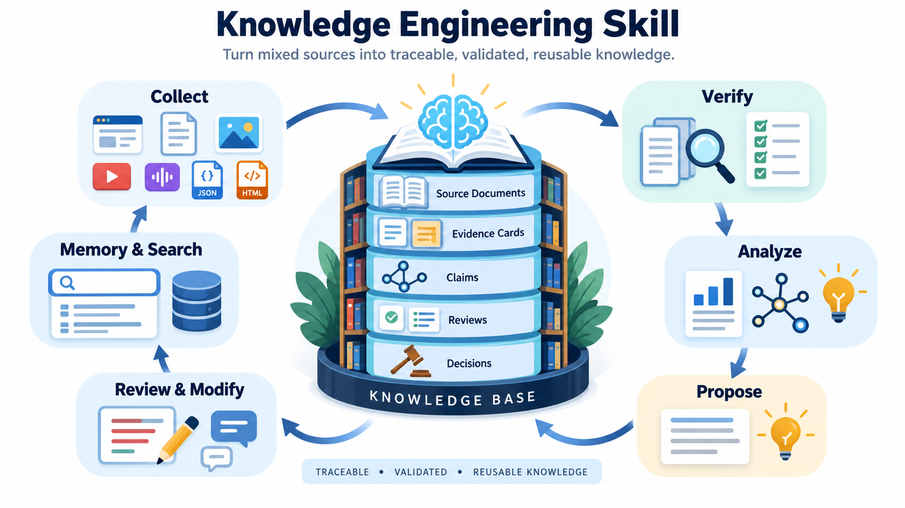
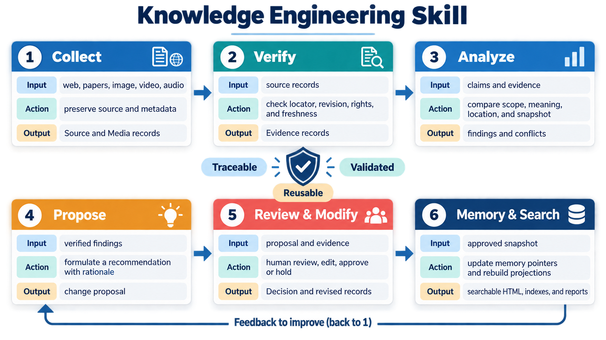
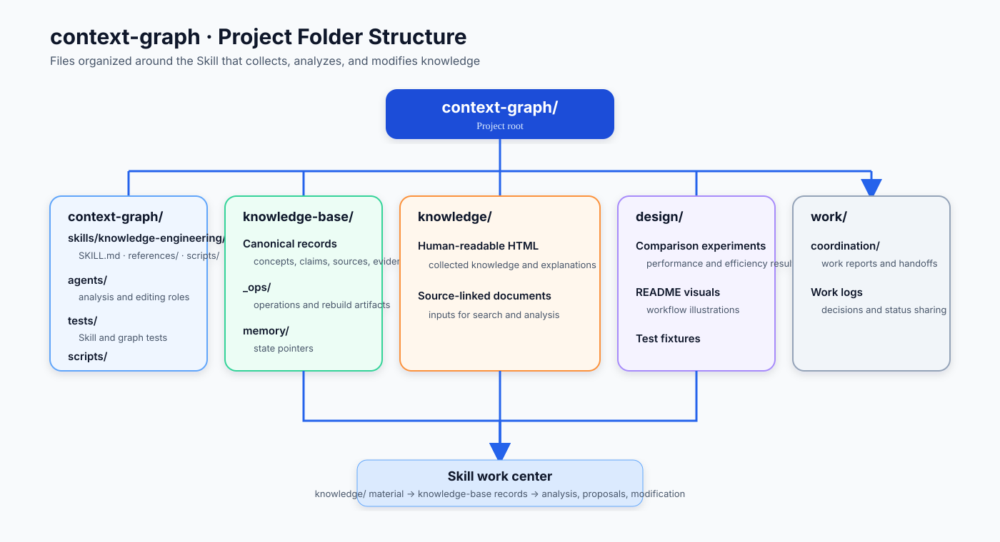

# Context Graph · Knowledge Engineering Skill



This project turns collected material into organized knowledge through analysis, proposals, and human-guided revision.

## Core workflow

```text
Collect sources → organize originals → analyze → propose → review and modify
```

### What each stage does



The project Skill is `context-graph/skills/knowledge-engineering/SKILL.md`. It connects knowledge building, analysis, proposals, review, and modification in one workflow.

## Install and share

### Codex or ChatGPT Skills

Download `context-graph-skill-v0.3.5.zip` from the [v0.3.5 release](https://github.com/JadeKim042386/context-graph/releases/tag/v0.3.5), then open **Skills → Create → Upload** and select the ZIP file. Enable the uploaded Skill for the workspace or project where it should run.

### Claude Code

Install the repository as a local Claude Code marketplace:

```text
/plugin marketplace add https://github.com/JadeKim042386/context-graph.git
/plugin install context-graph@context-graph
```

The plugin can also be submitted to Anthropic's [official Claude Code plugin directory](https://github.com/anthropics/claude-plugins-official) for review. Approval is controlled by Anthropic; the repository remains installable directly while review is pending.

### Repository installation

For either runtime, clone the tagged release and use the included Skill directory:

```bash
git clone --branch v0.3.5 https://github.com/JadeKim042386/context-graph.git
```

Codex-compatible Skill path: `context-graph/skills/knowledge-engineering/`

Claude Code plugin root: `context-graph/`

### Runtime compatibility

The skill content is shared by Codex and Claude Code, while each runtime keeps
its own project instructions. Codex projects may use `AGENTS.md`; Claude Code
projects should use `CLAUDE.md`. Claude Code does not automatically load
`AGENTS.md`. The skill does not require either file unless the host project
already uses it for shared rules.

Script paths are also runtime-specific: Claude Code resolves plugin scripts
through `${CLAUDE_PLUGIN_ROOT}`, while Codex and repository checkouts use paths
relative to the project root. This avoids requiring a Claude-only environment
variable in Codex.

## Skill scope

- Collect and normalize papers, web pages, and media
- Create `Concept`, `Claim`, `Source`, `Evidence`, `Media`, `Review`, `Decision`, and `Question` records
- Organize the scope, meaning, and relationships of source material
- Write proposals based on analysis
- Apply reviewed changes to knowledge records

## Folder structure



Canonical records are reviewed and modified by people. Generated HTML, indexes, and graphs are derived from those records and are not edited directly.

## Record types and decisions

| Record | Purpose |
|---|---|
| `Source` | URL or path, revision, hash, and rights state of an original |
| `Evidence` | A selector, page, row, region, or time range that can be found again |
| `Claim` | One sentence that can be reviewed as true or false |
| `Review` | A reviewer's finding and proposed correction |
| `Decision` | An accepted, held, or rejected change |
| `Question` | A repeatable question with scope and reference date |

Answers use one of three states:

- `answer`: an accepted Claim has reproducible Evidence
- `conflict`: evidence within the same scope is incompatible
- `abstain`: evidence is missing, stale, unknown, or unlocatable

Matching words alone do not establish agreement. Compare question scope, Claim meaning, Evidence location, Source revision, and answer scope.

## Existing local graph tool

The existing `context-graph/scripts/` tool copies explicit statements and relationships from Markdown and HTML into a local graph. It is separate from the new Knowledge Engineering Skill.

```bash
python context-graph/scripts/build_map.py --help
python context-graph/scripts/ask.py "question"
python context-graph/scripts/ask.py --conflicts
```

## License

MIT
